# DataDEX操作流程

## 1.输入密钥登输录自己的账号

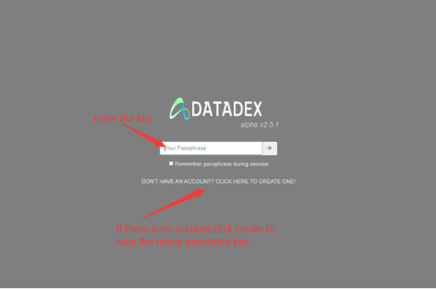

## 2.登陆成功后，点击“Create New Dataset”弹出表单，填写表单内容，填写完成点击“Issue Dataset”，去区块链浏览器查看ATCreate的交易

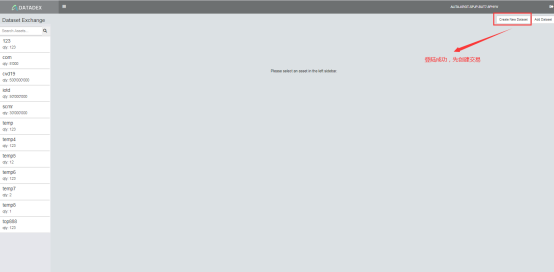

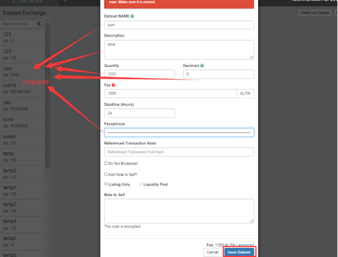

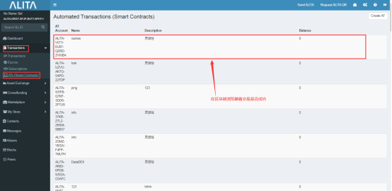

## 3.在ATCreate看到交易信息后，回到DateDEX，点击“Add Dataset”，此时在下拉框中有您最新新创建交易的Dataset NAME，选择创建交易的名称（需等待交易确认，如果没显示需刷新重新登录）。登录后继续点击“Add Dataset”选中新创建的交易名称，将交易添加到左侧菜单，单击左侧新添加的交易，此时在右上方的会弹出“Add Liquidation”按钮。并且在右面可以进行交易

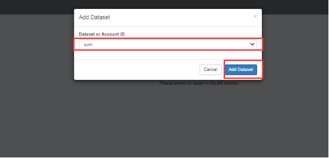

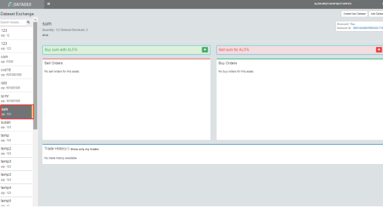

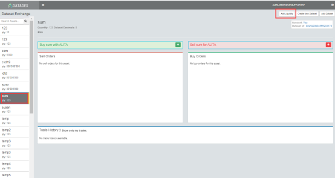

## 4.点击“Add Liquidation”增加流动性，应该产生两笔交易，一个ALITA和DataToken的转账

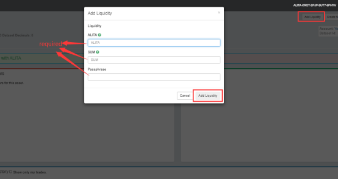

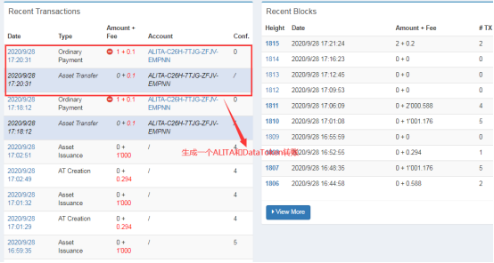

## 5.创建买单和创建卖单，能自动计算价格，并且自动购买。创建买单和卖单也是自动交易（buy和sell是相同的）

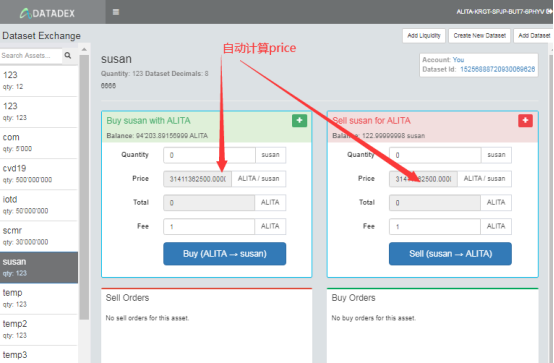

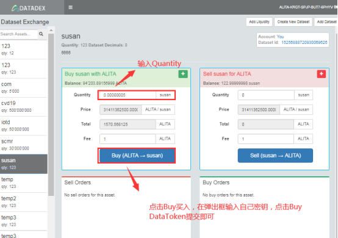

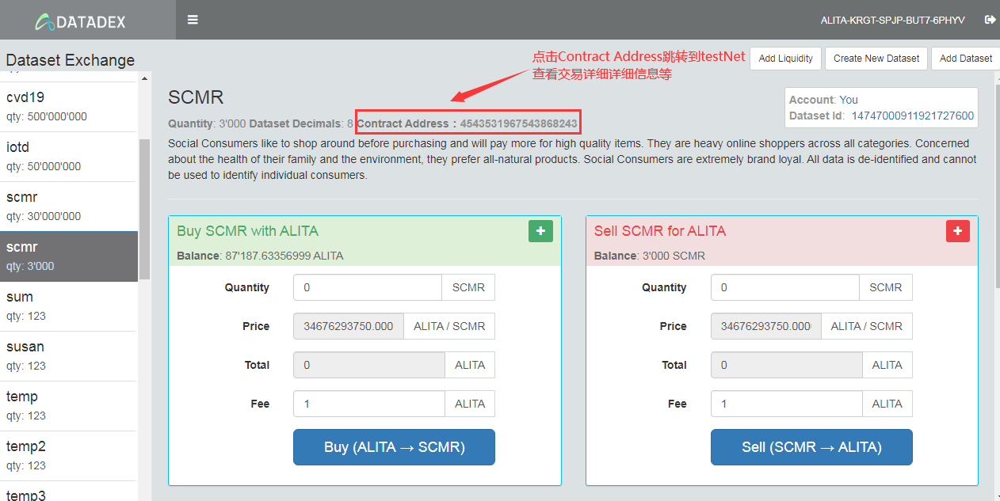

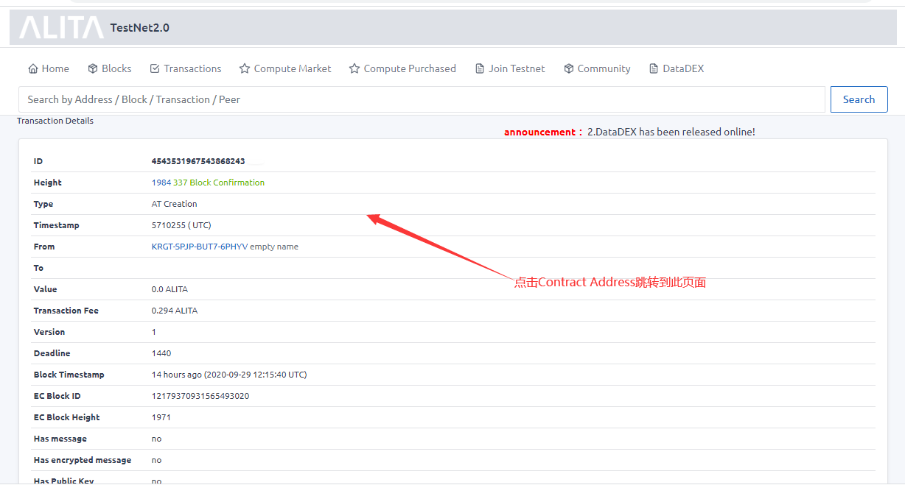

## 6.在这里申请测试Token

https://s.surveyplanet.com/ouJKU3KF7

