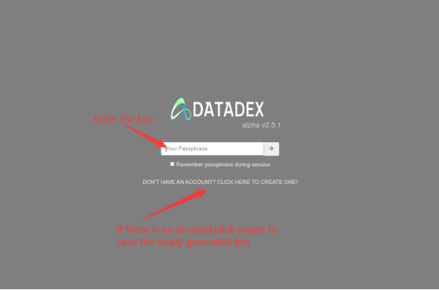
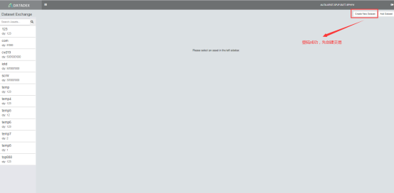
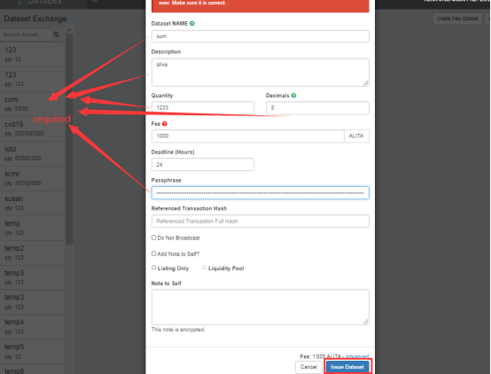
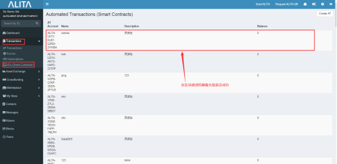
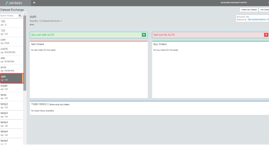
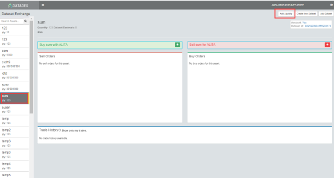
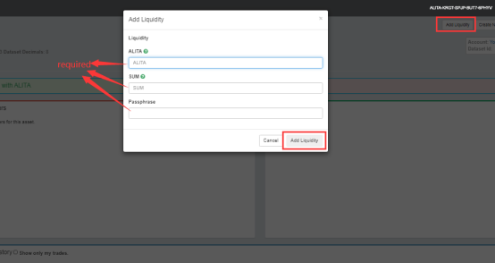
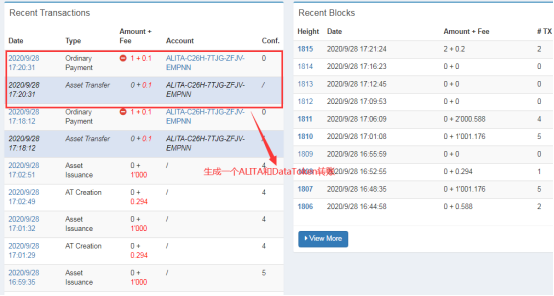
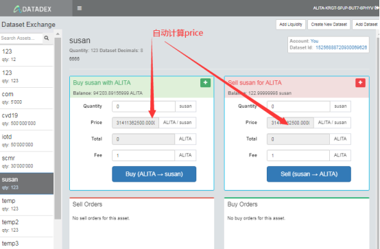
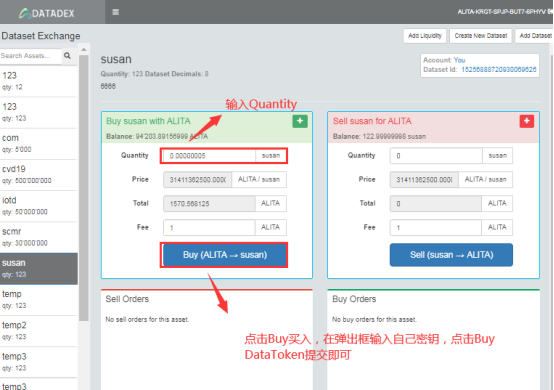

# Datadex operation flow

## 1.Enter the key and enter your own account number

##2.After successful login, click "create new dataset" to pop up the form, fill in the form content, and click "issue dataset" to view the transaction of atcreate in the 
blockchain browser

##3.After atcreate sees the transaction information, return to datedex and click "add dataset". At this time, the latest dataset name of the transaction you created will be displayed in the drop-down box. Select the name of the transaction to be created (wait for transaction confirmation, if not, refresh and log in again). After logging in, continue to click "add dataset" to select the newly created transaction name, add the transaction to the left menu, and click the newly added transaction on the left. At this time, the "add liquidity" button will pop up in the top right. And you can trade on the right

##4.Click "add liquidity" to increase liquidity. There should be two transactions, one is the transfer of Alita and datatoken

##5.Create a purchase order and create a sales order, can automatically calculate the price, and automatically purchase. Creating buy and sell orders is also an automatic transaction

